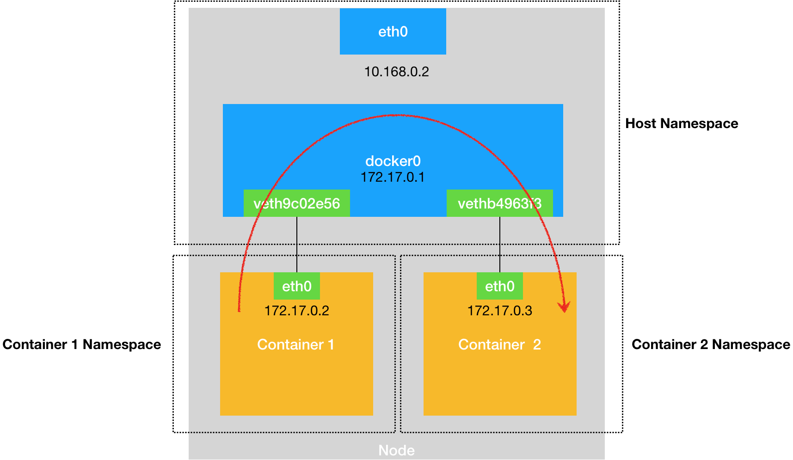

* TOC
{:toc}

## 宿主机内的容器通信

基本思路：
- 宿主机内创建网桥设备，称为 Bridge。是一个虚拟的二层交换机，实现的效果是根据 MAC 地址转发报文，内部有自学习机制，能够自动维护 MAC 地址和物理端口的映射表。
- 创建一对 Veth Pair 设备，这种设备以虚拟网卡的形似存在，一端放在容器内部，另一段放在宿主机上，并且与宿主机网桥相连。
- 容器内的报文都被路由给 Veth Peer 网卡，网卡收到后就转给宿主机的网桥，再由网桥根据 MAC 地址转发到另一个 Veth Peer 设备上。从而实现宿主机内容器的通信。

